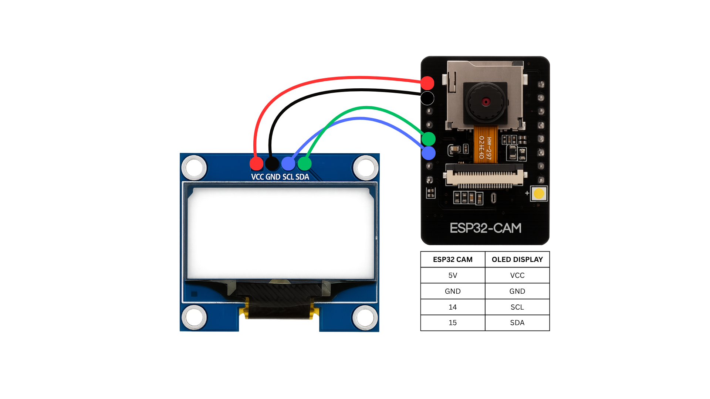

# ESP32-CAM to 1.3" OLED Display - The Low Resolution Live Feed

This project demonstrates how to stream a live camera feed from an ESP32-CAM module to a 128x64 OLED display. This guide will walk you through the setup, highlight common pitfalls (and how to dodge them), and provide a working example. By the end, you'll have a tiny video feed running—perfect for spying on your pet hamster or just flexing your DIY skills! (I tried this just because I wanted to)

  

## Features
- Streams live video from the ESP32-CAM to an 1.3" 128X64 OLED display
- Optimized for low memory usage with a 96x96 grayscale feed
- Avoids pin conflicts and faulty PSRAM issues
- Includes an HTML simulator to preview the output
- **Comprehensive debugging on both Serial Monitor and OLED display**
- **Real-time memory monitoring and error tracking**

## Hardware Requirements
- **ESP32-CAM module (AI-Thinker)**: The main camera and processing of the operation.
- **128x64 OLED display (SH1106-based)**: The tiny screen.
- **Jumper wires**: For connecting the dots.
- **Breadboard (optional)**: Keeps things tidy, but not mandatory.

## Software Requirements
- **Arduino IDE**: With ESP32 board support installed (add via Boards Manager: `https://dl.espressif.com/dl/package_esp32_index.json`).
- **Adafruit_SH110X library**: For SH1106 OLED displays.
- **Adafruit_GFX library**: For drawing on the OLED.

## Circuit Diagram
  
*Connect the OLED to the ESP32-CAM as shown. Use GPIO 15 (SDA) and GPIO 14 (SCL) to steer clear of camera-related pin conflicts.*

## Setup Instructions
1. **Install Software**:
   - Open Arduino IDE, go to `File > Preferences`, and add the ESP32 board support URL.
   - Install the ESP32 boards package via `Tools > Board > Boards Manager`.
   - Install the Adafruit_SH110X and Adafruit_GFX libraries via `Sketch > Include Library > Manage Libraries`.
2. **Wire It Up**:
   - Follow the circuit diagram. Double-check connections—loose wires will cause a lot of crying under the pillow in any hardware projects!
3. **Upload the Code**:
   - Open `esp32cam_to_oled.ino` in Arduino IDE.
   - Select `AI Thinker ESP32-CAM` under `Tools > Board`.
   - Set the partition scheme to `Huge APP (3MB No OTA)` for extra space (`Tools > Partition Scheme`).
   - Connect your ESP32-CAM via USB and upload. You may need to press the **Boot** button for 3-4 seconds when uploading starts.
4. **Power Supply**:
   - Use a stable 5V USB power source. PC USB ports usually provide stable enough power but sometimes the ESP32-CAM can be picky.

## How It Works
The code captures a 96x96 grayscale image from the camera, converts it to a 1-bit bitmap, and displays it on the 128x64 OLED. Here's a breakdown with key snippets:

### Camera Setup
```cpp
camera_config_t config;
// ... (pin configurations)
config.frame_size   = FRAMESIZE_96X96;    // Small size to save memory
config.pixel_format = PIXFORMAT_GRAYSCALE; // Grayscale reduces data
config.fb_location  = CAMERA_FB_IN_DRAM;  // Uses DRAM, avoids faulty PSRAM
```
- *Why this matters*: I used a tiny resolution and DRAM because some clone ESP32-CAM modules (at least the one I used) have PSRAM as consistent as a cat's affection. This keeps things stable.

### Frame Conversion
```cpp
void convertFrameToBitmap(const camera_fb_t* fb) {
    // Converts 96x96 grayscale to 128x64 1-bit bitmap
    // Scales and thresholds pixels for OLED display
}
```
- *What it does*: Takes the camera's grayscale image, scales it to fit the OLED, and turns it into black-and-white pixels (1-bit) to save memory.

### Display Update
```cpp
display.clearDisplay();
display.drawBitmap(0, 0, bitmapBuffer, 128, 64, 1);
display.display();
```
- *Simple explanation*: Wipes the screen clean, draws the new frame, and shows it on the OLED—like a mini movie projector!

## Debugging Features

The code includes comprehensive debugging to help you troubleshoot issues:

### Serial Monitor Debugging
The Serial Monitor (115200 baud) provides detailed information:

**Memory Monitoring**:
```
Free heap: 234567 bytes, Min free heap: 198432 bytes
PSRAM total: 4194304, free: 0 (WARNING: PSRAM may be faulty)
```

**Camera Initialization**:
```
Camera init attempt 1/5...
Camera initialized successfully!
Camera sensor configured for stability
```

**Runtime Statistics** (every 100 frames):
```
Stats - Frames: 500, Errors: 23 (4.4%), Free mem: 201456
```

**Error Detection**:
```
Camera init attempt 1 failed: 0x105
  -> Out of memory (DRAM insufficient)
```

### OLED Display Debugging

  

The OLED shows real-time status information:

**During Startup**:
- "Initializing camera..."
- "System ready! Streaming..."

**Status Information**:
- Current frame count
- Error count and percentage
- Free memory available

**Error States**:
- "Camera FAILED! PSRAM issue detected"
- "Hardware DEFECT! PSRAM faulty Try different module"

### Test Functions
**OLED Test Pattern**: Verifies display functionality before camera initialization:
```cpp
void testOLED() {
    // Displays test patterns and text to verify OLED is working
}
```

**I2C Device Detection**: Checks if OLED is properly connected:
```
I2C device found at address 0x3C
```

## Challenges and Solutions
Here are the hurdles I hit and how I fixed them (so you don't have to):

1. **Wrong Display Library**:
   - *Problem*: Started with SSD1306 by following most tutorials, but it didn't work with my SH1106 OLED.
   - *Solution*: Switched to `Adafruit_SH110X`. Always match your library to your display type!

2. **Pin Conflicts**:
   - *Problem*: Used pins 2 and 4 for I2C, but the flash LED interfered, and some pins were tied up by the camera.
   - *Solution*: Settled on GPIO 15 (SDA) and GPIO 14 (SCL). Avoid camera pins like GPIO 1, 3 (UART), 4 (flash LED), and others—check the [ESP32-CAM pinout](https://randomnerdtutorials.com/esp32-cam-ai-thinker-pinout/) for details.

3. **Memory Woes**:
   - *Problem*: PSRAM sounded great but failed (a common defect). Even smaller RAM struggled with higher resolutions.
   - *Solution*: Used 96x96 resolution and DRAM only. Check your memory with `esp32_cam_ram_check.ino` if you suspect issues.

## Troubleshooting

### Using the Debug Information
1. **Open Serial Monitor** at 115200 baud to see detailed logs
2. **Watch the OLED** for real-time status updates
3. **Check memory stats** - low free heap indicates memory issues
4. **Monitor error rates** - high error rates suggest hardware problems

### Common Issues
- **Blank/Garbled Display**: 
  - Verify you're using `Adafruit_SH110X` (not SSD1306) and check wiring (SDA to 15, SCL to 14)
  - Check Serial Monitor for "I2C device found at address 0x3C"
  
- **Camera Won't Start**: 
  - Ensure a solid power supply—try a different USB cable or port
  - Look for "Camera init attempt X/5" messages in Serial Monitor
  
- **Memory Errors**: 
  - If PSRAM fails, the code defaults to DRAM. Confirm with `ESP.getFreePsram()`—zero means it's kaput
  - Monitor free heap values - should stay above 150KB during operation

- **High Error Rates**:
  - Check Serial Monitor for error statistics
  - Values above 10% error rate suggest hardware issues
  - OLED will display current error count

### Debug Configuration
Key debugging constants you can adjust:
```cpp
#define FRAME_DELAY_MS 50        // ~20 FPS (adjust for performance)
#define BRIGHTNESS_THRESHOLD 64  // Tweak for better contrast
#define MAX_RETRIES 5           // Camera init retry attempts
#define STARTUP_DELAY_MS 3000   // Power stabilization delay
```

## Simulation
Want to see what the output looks like without hardware? Open `cam_vis.html` in a browser. It uses your webcam to mimic the OLED's black-and-white display.

## Conclusion
You've now got an ESP32-CAM streaming to an OLED display, sidestepping hardware quirks like a pro. The comprehensive debugging features will help you identify and resolve any issues quickly. Feel free to tweak the resolution (if you dare) or add features like motion detection.
